

32-bit Processor Design

Zaman Ishtiyaq | 15CS01043 | Autumn Semester 2017

*Contents*

[Overall Architecture](#overall-architecture)

[Instruction Format](#instruction-format)

[Instruction Set](#instruction-set)

[Components of Processor](#components-of-the-processor)

[Running an Example](#running-an-example)

Overall Architecture
====================

| 1.  General purpose registers    | 32                                  |
|----------------------------------|-------------------------------------|
| 1.  Clock cycles per instruction | 4                                   |
| 1.  Instructions                 | 8                                   |
| 1.  Memory                       | R.A.M (18-bit Address &32-bit Data) |
| 1.  Special Registers            | RA, RB, RC, RZ, RY                  |

Instruction Format
==================

> OOO AAAAA BBBBB XXXXXXXXXXXXXXXXXXX

| OOO                   | OP-CODE   |
|-----------------------|-----------|
| AAAAA                 | RA        |
| BBBBB                 | RB        |
| XXXXXXXXXXXXXXXXXXX   | IMMEDIATE |

Instruction Set
===============

| **OP-Code** | **Instruction**           | **RTN**                       |
|-------------|---------------------------|-------------------------------|
| 000         | LOAD RA, RB, IMMEDIATE    | RB \[ \[RA\]+IMMEDIATE \]     |
| 001         | STORE\* RA, RB, IMMEDIATE | \[RB\] \[ \[RA\] +IMMEDIATE\] |
| 010         | MOV RA, RB                | RB \[RA\]                     |
| 011         | JUMP RA, RB, IMMEDIATE    | PC IMMEDIATE                  |
| 100         | ADD RA, RB                | RB \[RA\] + \[RB\]            |
| 101         | SUBTRACT RA, RB           | RB \[RA\] - \[RB\]            |
| 110         | MULTIPLY RA, RB           | RB \[RA\] \* \[RB\]           |
| 111         | DIVIDE RA, RB             | RB \[RA\] / \[RB\]            |

\* STORE can only write to the RAM so the IMMEDTIATE value should be of
the form **1**XXXXXXXXXXXXXXXXXX as Chip-Select has to select RAM
otherwise it will try to write on to the ROM and it will have no effect.

Components of the Processor
===========================

Following are the components along with their figures:

1.  ***Processor
    Pipeline:***

2.  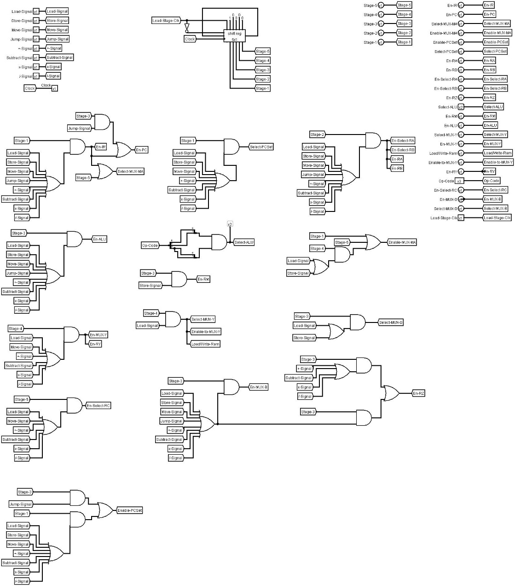***Control
    Unit***

    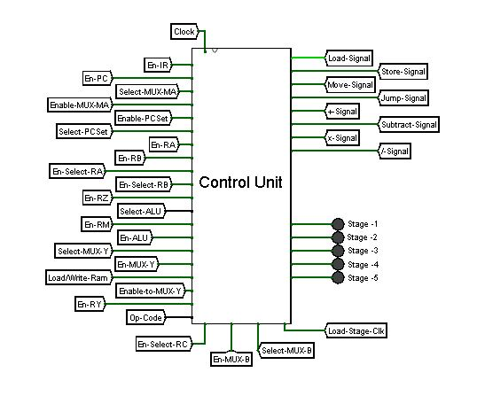

3.  ***Fetch Unit:***

    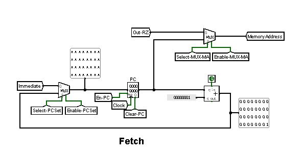Fetch Unit
    increments the PC or jumps to a new address (Immediate Value) when
    JUMP command is given.

4.  ***Instruction Register and Instruction Decoder:***

    

5.  ***ALU:***

    Supports Addition, Subtraction, Multiplication and Division.

    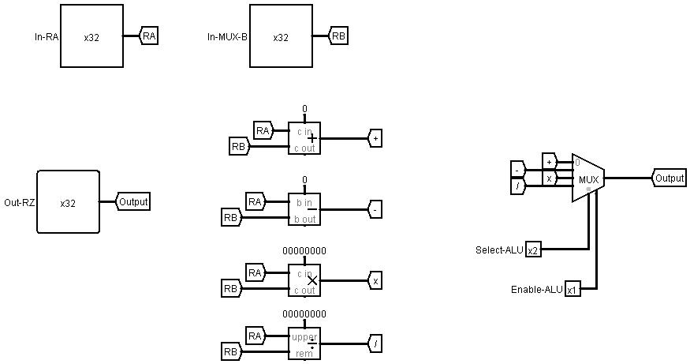

6.  ***ROM-RAM:***

    We write our programs on ROM. ROM and RAM are selected based on Chip
    Select which changes on different operations.

    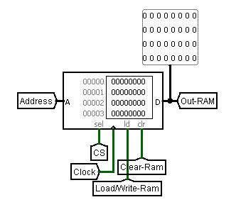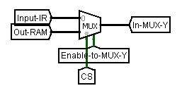

    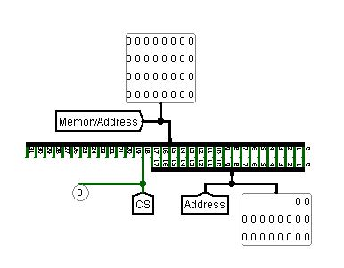

<!-- -->

1.  ***Register File (Internal Circuit):***

    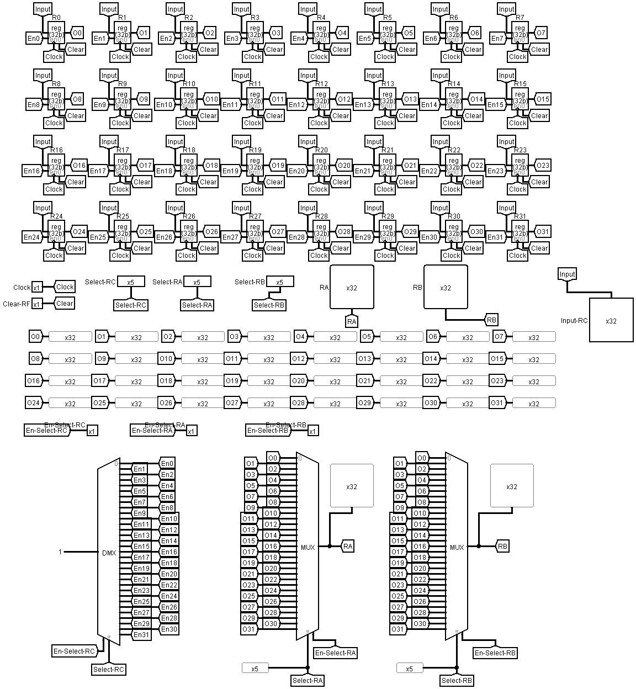

2.  3.  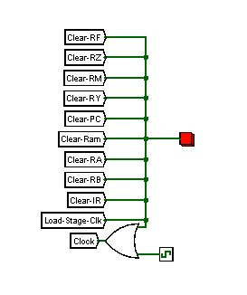9.
    ***Reset Button*** Resets Everything except ROM.

Running an Example
==================

Let us perform the following example:

Initially:

1.  Press the RED

2.  Change the Register Values in RF to:

**R0**: 1 **R1**: 3 **R2**: 7 **R3**: 6 **R4**: 2 **R5**: 1 **R6**: 2

1.  Let’s Load the ROM with the following values:

    00000 : 46280000

    00001 : 80080000

    00002 : a3200000

    00003 : c3280000

    00004 : e5080000

    00005 : 0008000a

    00006 : 202c0000

    00007 : 6000000f

    00008 : 00000000

    .

    .

    .

    0000b : 00000011

    .

    .

    .

    0000f : 80080000

    00010 : 80080000

When Executed following happens:

Initially the
RF looks like :

**R0**: 1 **R1**: 3 **R2**: 7 **R3**: 6 **R4**: 2 **R5**: 1 **R6**: 2

1.  46280000 in binary is 01000110001010000000000000000000

    i.e. MOV R6, R5

    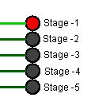

-   **Stage – 1: Fetch to IR**

    

-   **Stage – 2: RA gets value from R6**

    

    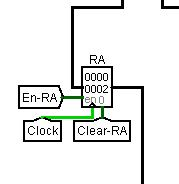RA \[R6\]

-   **Stage – 3: RA gets value from R6**

    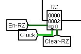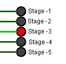

    RA’s value passes unchanged through ALU to RZ

-   **Stage – 4: RY gets value from RZ**

    

    

    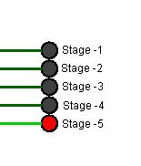

-   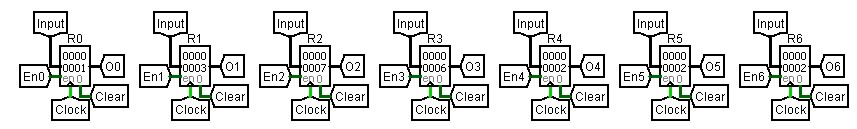**Stage –
    5: R5 gets value from RZ**

    Values Now:

    **R0**: 1 **R1**: 3 **R2**: 7 **R3**: 6 **R4**: 2 **R5**: 2 **R6**:
    2

    And PC is incremented to next instruction :

    

1.  80080000 in binary is 100 00000 00001 0000000000000000000

    i.e. ADD R0, R1 or R1 \[R0\] + \[R1\]

-   **Stage – 1: Fetch to IR**

    Similar to
    above

-   **Stage – 2: RA, RB get their values from RF**

-   **Stage – 3: ALU performs addition**

-   **Stage – 4: RY gets value from RZ**

-   **Stage -5: R1 gets value from RY and PC++**

    i.e. R1 1 + 3 (=4)

    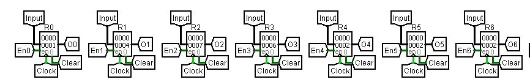

    Values Now:

    **R0**: 1 **R1**: 4 **R2**: 7 **R3**: 6 **R4**: 2 **R5**: 2 **R6**:
    2

1.  a3200000 in binary is 101 00011 00010 0000000000000000000

    i.e. SUB R3, R4 or R4 \[R3\] - \[R4\]

-   **Stage – 1: Fetch to IR**

    

-   **Stage – 2: RA, RB get their values from RF**

-   **Stage – 3: ALU performs Subtraction**

-   **Stage – 4: RY gets value from RZ**

-   **Stage -5: R4 gets value from RY and PC++**

    i.e. R4 6 - 2 (=4)

    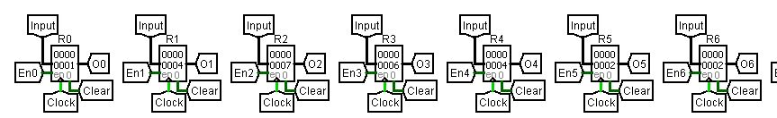

Values Now:

**R0**: 1 **R1**: 4 **R2**: 7 **R3**: 6 **R4**: 4 **R5**: 2 **R6**: 2

1.  c3280000 in binary is 110 00011 00101 0000000000000000000

    i.e. MUL R3, R5 or R5 \[R3\] \* \[R5\]

-   **Stage – 1: Fetch to IR**

    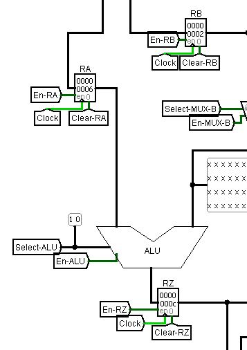

-   **Stage – 2: RA, RB get their values from RF**

-   **Stage – 3: ALU performs Multiplication**

-   **Stage – 4: RY gets value from RZ**

-   **Stage -5: R5 gets value from RY and PC++**

    i.e. R5 6 \* 2 (=12)

    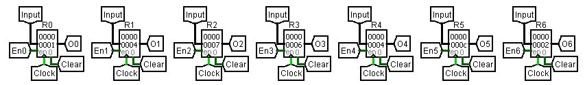

Values Now:

**R0**: 1 **R1**: 4 **R2**: 7 **R3**: 6 **R4**: 4 **R5**: 12 **R6**: 2

1.  e5080000 in binary is 111 00101 00001 0000000000000000000

    i.e. DIVIDE R5, R1 or R1 \[R5\] / \[R1\]

-   **Stage – 1: Fetch to IR**

-   **Stage – 2: RA, RB get their values from RF**

    

-   **Stage – 3: ALU performs Division**

-   **Stage – 4: RY gets value from RZ**

-   **Stage -5: R1 gets value from RY and PC++**

    i.e. R5 12 / 4 (=3)

    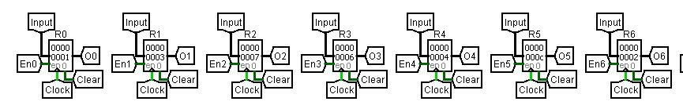

Values Now:

**R0**: 1 **R1**: 3 **R2**: 7 **R3**: 6 **R4**: 4 **R5**: 12 **R6**: 2

1.  0008000a in binary is 000 00000 00001 0000000000000001010

    i.e. LOAD R0, R1, \#10 or R1 \[ \[R0\] + 10 \]

-   **Stage –
    1: Fetch to IR**

-   **Stage – 2: RA get their values from RF, RB gets IMMEDIATE value**

-   **Stage – 3: ALU performs Addition, RY gets the address to be read
    from**

-   **Stage – 4: RY gets value from the ROM/RAM at address in RY**

-   **Stage -5: R0 gets value from RY and PC++**

    i.e. R0 \[ \[1 + 10\] \] which is 0000b location on ROM and the
    value there is

    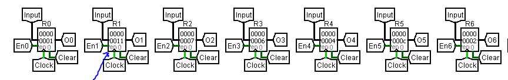000000011 ,
    therefore R0 &lt;- 00000011 or 17

Values Now **R0**: 1 **R1**: 17 **R2**: 7 **R3**: 6 **R4**: 4 **R5**: 12
**R6**: 2

1.  202c0000 in binary is 001 00000 00010 1000000000000000000

    i.e. STORE R0, R5, \#0 or \[R0\] + 0 \[R5\] i.e. RAM gets written at
    this location by \[R5\]

-   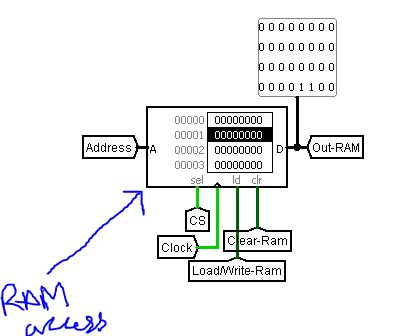**Stage –
    1: Fetch to IR**

-   **Stage – 2: RA get their values from RF, RB gets IMMEDIATE value**

-   **Stage – 3: ALU performs Addition, RY gets the address to be write
    onto, RM gets value of R5  
    **

-   **Stage – 4: Value of RM is written on the address in RY**

-   **Stage
    -5: PC++**

    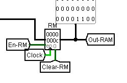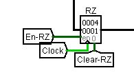

1.  6000000f in binary is 011 00000 00000 00000000000000001111

    i.e. JUMP IMMEDIATE or PC location 0000f on ROM

-   **Stage – 1: Fetch to IR**

    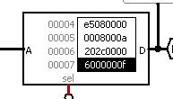

-   **Stage – 2: -**

-   **Stage – 3: MUX-PCSet is Enabled and IMMEDIATE is Selected  
    **

-   **Stage – 4: PC gets value of IMMEDIATE**

-   **Stage
    -5: PC++**

    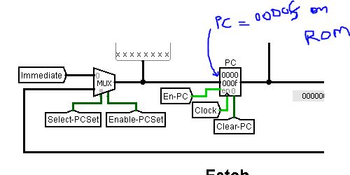

Now the further instructions are executed from this point onwards.
